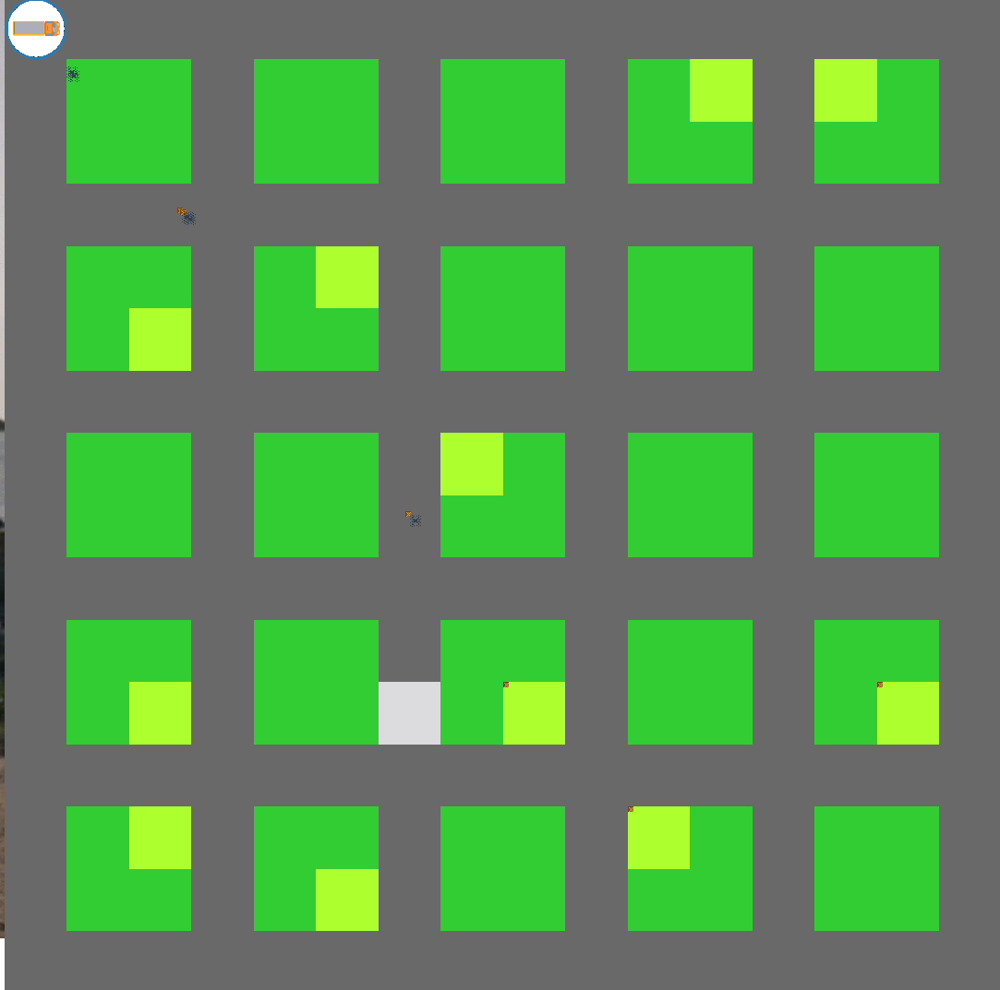

# Model-Based Systems Engineering - Simulating a futuristic package delivery service using drones.

This project have been done as a part of the course 02223 - Model-Based Systems Engineering at DTU in the Fall of 2022

A video of the running simulator can be found [here.](https://youtu.be/Zj8hlKBSeCk)

## Running the simulator 

*Before running the project please install the Dependencies and look at the config section*

    python3 simulation.py 

## Dependencies 

To run the project please install the following packages by using pip or pip3:

    pip3 install pygame==2.1.3.dev8 pygame_gui dependency_injector configparser scikit-learn sklearn numpy pandas matplotlib pandas

## Using the UI

- By pressing "U" will zoom in
- by pressing "D" will zoom out

- The arrow keys can be used to explore the environment.

## Config 

The main config file **config.ini** contains all the global parameters. the file is grouped by sections '[section]'.

### graphics [section]

* scale - the scale the simulation starts at.
* fullscreen (1 = fullscreen, 0 = window)
* window_h (height in px of window)
* window_w (width in px of window)

### setup [section]

#### Simulation environment parameters
* world_size
* ground_size
* road_size=1
* customer_density

    Be aware that unsupported configs does exist. If the simulator can not make a meaningful environment it will simply close right after it starts.

Please look at the section [Neighborhood (env) structure](#neighborhood-env-structure) to understand the parameters.

#### Simulation parameters 

* number_of_tasks=50 (value from 0-1000, number of packages that is in the truck)
* number_of_drones=10 (value from 0-1000, The number of drones there should be simulated)
* simulation_speed=200 (1-500) (1 = realtime speed, 500 = as fast as the computer can go.)
* auto_close_window=1 (1 or 0, if 1 the window will close when the simulation is done.)
* drone_speed = 200 (value from 50-500)
* truck_speed = 150 (value from 50-500)
* customer_density=0.5 (the possibility of a house owner in the neighborhood to be a customer awaiting a package)
* truck_stop_density=0.05 (the percentage of the travel distance that the truck should consider as a stop pos)
* min_package_weight=200 (the minimum weight of the generated packages)
* max_package_weight=2000 (the maximum weight of the generated packages)

Options for a truck: 
* moving_truck = 1 -> the truck moves
* moving_truck = 0 and random_position = 0 -> stationary truck with the optimal position
* moving_truck = 0 and random_position = 1 -> stationary truck with the random position

# Definitions (Conventions of the project)

## ENV service (env_service.py) 

Creates the 2D representation of a neighborhood

#### Neighborhood (env) structure

* Road : "R"
* Ground: “.”
* Delivery spot: "S"
* Truck: "T"

For instance will the input (world_size=15, ground_size=5, road_size=1, customer_density=0.5) result in the neighborhood
below. This representation is called a layout in the code. **Please change the parameters in the main config file**.

    (layout, delivery_sports, number_of_grounds, number_of_customers), truck_pos = create_layout_env(15, 5, 1, 0.5)

     R  R  R  R  R  R  R  R  R  R  R  R  R  R  R  R 
     R  .  .  .  .  R  .  S  .  .  R  .  .  .  .  R 
     R  .  .  .  .  R  .  .  .  .  R  .  .  .  .  R 
     R  .  .  .  .  T  .  .  .  .  R  .  .  .  .  R 
     R  S  .  .  .  R  .  .  .  .  R  .  .  S  .  R 
     R  R  R  R  R  R  R  R  R  R  R  R  R  R  R  R 
     R  .  .  S  .  R  .  .  .  .  R  .  .  .  .  R 
     R  .  .  .  .  R  .  .  .  .  R  .  .  .  .  R 
     R  .  .  .  .  R  .  .  .  .  R  .  .  .  .  R 
     R  .  .  .  .  R  .  .  .  .  R  .  .  .  .  R 
     R  R  R  R  R  R  R  R  R  R  R  R  R  R  R  R 
     R  .  .  .  .  R  .  .  S  .  R  .  .  .  .  R 
     R  .  .  .  .  R  .  .  .  .  R  .  .  .  .  R 
     R  .  .  .  .  R  .  .  .  .  R  .  .  .  .  R 
     R  .  .  .  .  R  .  .  .  .  R  .  .  .  .  R 
     R  R  R  R  R  R  R  R  R  R  R  R  R  R  R  R 

A layout can be printed out byt using **print_layout(layout)**.

# truck path finding

Applying the path-finder to the layout above gives following route. 

* Start point = (0,0)
* End point = (len(layout) - 1, len(layout) - 1))

    planner = PatchFinder()

    route = planner.find_path(layout, (0, 0), (len(layout) - 1, len(layout) - 1))

The route is marked with the character "M".

    # shown in layout
     M  M  M  M  M  M  R  R  R  R  R  R  R  R  R  R 
     R  .  .  .  .  M  .  .  .  .  R  .  .  .  .  R 
     R  .  .  .  .  M  .  .  .  .  R  .  .  .  .  R 
     R  .  .  .  S  M  .  .  .  .  R  S  .  .  .  R 
     R  .  .  .  .  M  .  .  .  .  R  .  .  .  .  R 
     R  R  R  R  R  M  M  M  M  M  M  R  R  R  R  R 
     R  .  .  .  .  R  .  .  .  .  M  .  .  .  .  R 
     R  .  .  .  .  R  .  .  .  .  M  .  .  .  .  R 
     R  .  .  .  .  R  .  .  .  .  M  .  .  .  .  R 
     R  .  .  .  .  R  .  .  S  .  M  .  .  .  S  R 
     R  R  R  R  R  R  R  R  R  R  M  M  M  M  M  M 
     R  .  .  .  .  R  .  S  .  .  R  .  .  .  .  M 
     R  .  .  .  .  R  .  .  .  .  R  .  .  .  .  M 
     R  .  .  .  .  R  .  .  .  .  R  .  .  .  .  M 
     R  .  .  .  .  R  .  .  .  .  R  .  .  .  .  M 
     R  R  R  R  R  R  R  R  R  R  R  R  R  R  R  M 

# Definitions 

## Neighborhood (env) structure

* Road : "R"
* Ground: "dot"
* Delivery spot: "S"
* Truck path : "M" 

# Data (Experiments)

All data produced is in the folder 'simulation_batcher'.

In this folder each scenario has its own folder with the raw log files. Futhermore, a summary of the runs has been compiled in to a CSV file with the same name.

## Plots

Plots can be regenerated from the data by running the following files (with the path to the csv files updated):

* plot1.py
* plot2.py
* plot3_analysis.py
* plot4_analysis.py
